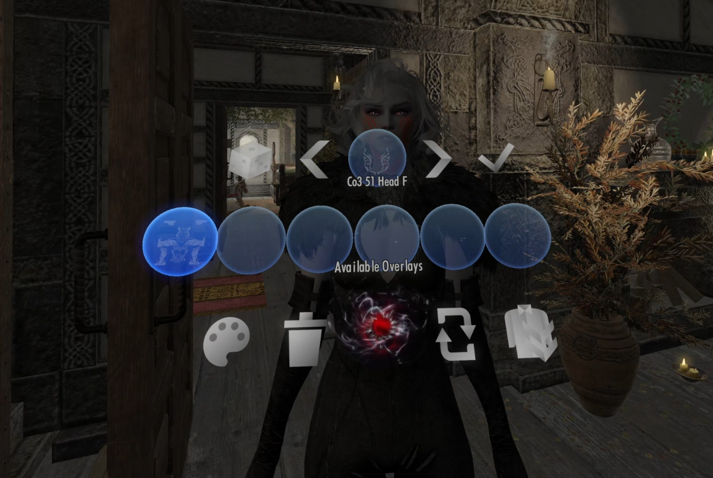
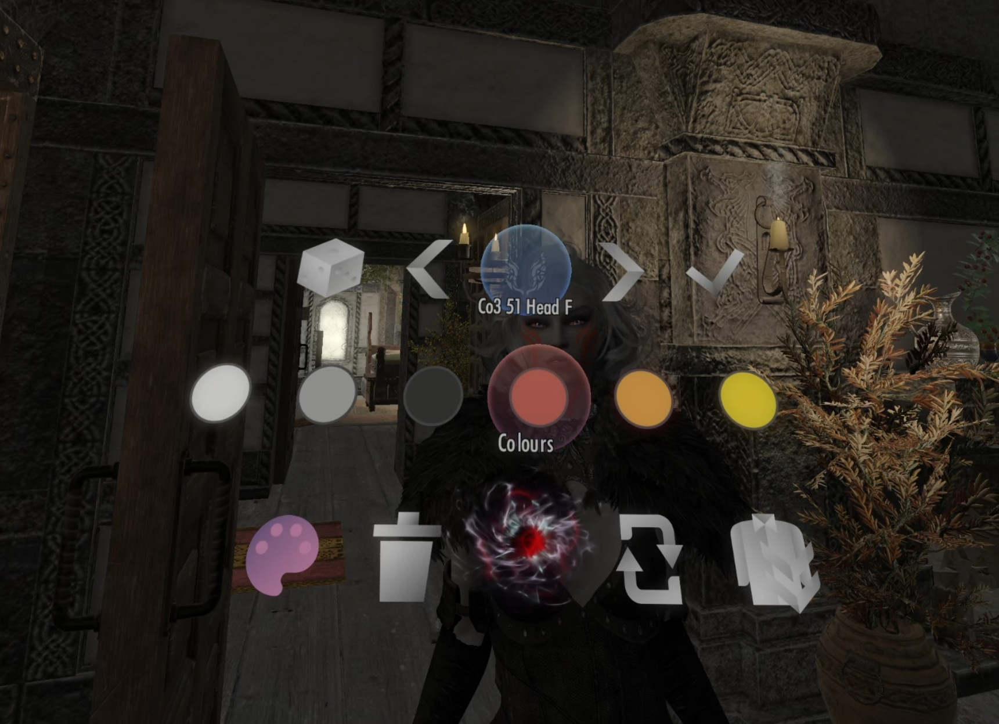

# VR NPC Editor

Grab an NPC in Skyrim VR and edit how they look — skin overlays and body — with your hands.

An SKSE plugin (`VRNPCEditor.dll`). No ESP, no Papyrus scripts, no MCM.

---

## What it does

Hold an NPC with one hand and pull the trigger on the other. The [3DUI](https://www.nexusmods.com/skyrimspecialedition/mods/169497) actor menu offers up to two slots — a palette and a T-pose figure — and each opens one editor on that actor.

### Overlay editor



Four rows: what the actor is already wearing, a stepper that browses one overlay at a time, the pack filter (or the colour swatches, which share that line), and a tool row.

- Reads every installed [Overlay Distribution Framework](https://www.nexusmods.com/skyrimspecialedition/mods/155120) pack, plus any SlaveTats texture pack found under `Data\textures\actors\character\slavetats`. SlaveTats itself is neither required nor called.
- Stepping writes the overlay to the actor through NiOverride's non-persistent path, so browsing is what you see on the body. Walking away from one keeps it; the check button is a shortcut, not a toll.
- 20 colours at full and 70% strength, plus four skin tones. A swatch repaints what was committed last, in place. The palette opens onto the pack row's line, so a palette nobody opened costs 3DUI nothing.

  

- Toggles between the grabbed NPC and the player without letting go.
- Undo and redo at the head of the tool row, a step per press, for the sitting.
- A body only has so many overlay slots. Once they are all spent the stepper and the pack filter are hidden, since there is nothing left to browse to; the applied row stays, and its items then take an overlay off rather than select it.

### Body editor

Four steppers and a tool row: BodySlide preset, weight in 25% steps, and — when [The New Gentleman](https://www.nexusmods.com/skyrimspecialedition/mods/104215) is installed — its addon list for that actor and the size category that goes with it.

With all four on offer they pack into two columns of two — weight over preset, addon over size — above the tool row, which halves the menu's height. Any of them missing and it falls back to the single column it has always been: a square with a hole in it reads as a menu that has broken.

Both editors share one **edit session**: undo reverts everything since you opened the NPC, across both.

---

## Requirements

| | | |
|---|---|---|
| [3DUI](https://www.nexusmods.com/skyrimspecialedition/mods/169497) | required | the menus, and the actor-menu gesture |
| [Skyrim VR Tools](https://www.nexusmods.com/skyrimspecialedition/mods/27782) | required | controller input |
| [HIGGS](https://www.nexusmods.com/skyrimspecialedition/mods/43930) | required | grabbing the NPC is the only way in |
| [RacemenuVR](https://www.nexusmods.com/skyrimspecialedition/mods/156898) | overlay editor | SKEE, which owns the overlay slots |
| [Overlay Distribution Framework](https://www.nexusmods.com/skyrimspecialedition/mods/155120) | overlay editor | the pack manifests, and persistence |
| [OBody NG](https://www.nexusmods.com/skyrimspecialedition/mods/77016) | body editor | presets and weight |
| [The New Gentleman](https://www.nexusmods.com/skyrimspecialedition/mods/104215) | optional | adds the addon stepper |

A missing optional dependency hides a feature and says so in the log; it never pops a notification. `HealthCheckManager` is the one place that knows what is installed and what that permits — every conditional button and eligibility test asks it rather than null-checking an interface of its own.

---

## How choices persist

Overlays are written into SKEE's overlay slots as persistent NiOverride overrides, so RaceMenu records them in its own co-save and puts them back — same slot, same tint — when the game is loaded. That is the whole persistence story; nothing is written outside RaceMenu.

This mod's co-save record holds the same set again, keyed by form: which overlays are ours, which slot each sits in, and the tint each was given. That is what the applied row highlights, what "take ours off" knows to remove, and what a restore puts back. It never paints anything by itself on load — RaceMenu has already done that.

Earlier builds mirrored every choice into an ODF distribution rule file instead. ODF re-applied those rules at game start on top of the overlays RaceMenu had already restored, so a choice landed twice — once where RaceMenu put it and once wherever ODF found a free slot, in ODF's own colour rather than the chosen one — and ran the actor out of slots doing it. `OdfCleanup` deletes that file, and the SlaveTats mod configs written to support it, once at plugin load.

ODF is still required, but only as a catalog: its `ODF_mod_configs` are where the list of installed overlay packs comes from.

**Overlays are limited to unique, named NPCs.** That came from ODF, whose rules could target an actor only by editorID — one shared by every actor spawned from a generic base record. RaceMenu has no such limit, so the restriction is now a choice rather than a constraint. The body editor never had it — OBody stores its assignment per actor instance.

---

## Configuration

`Data\SKSE\Plugins\VRNPCEditor.ini`, written with defaults and a comment per key on first run. Delete it to regenerate.

| Section | Keys |
|---|---|
| `[General]` | `logLevel` |
| `[Menu]` | `fElementScale`, `sDefaultPack`, `bImportSlaveTats`, `bPreloadCatalog` |
| `[Body]` | `bEnableBodyMenu`, `bEnableWeightButton`, `bEnableTngAddon`, `iPresetRepeatDelayMs`, `iPresetRepeatIntervalMs`, `iWeightResetDebounceMs`, `iTngApplyDebounceMs`, `iTngPrimeTimeoutMs` |

---

## Building

Needs vcpkg with `VCPKG_ROOT` set, and MSVC. Dependencies come from `vcpkg.json`: CommonLibSSE-NG (fork), DirectXTK, SimpleIni, nlohmann-json.

```powershell
cmake --preset build-release-msvc
cmake --build --preset release-msvc
```

The DLL lands in the preset's binary directory, `build/release-msvc/VRNPCEditor.dll`. Deploy it alongside `assets/icons/dds/*` (as `Data\textures\VRNPCEditor\`); the INI writes itself on first run.

`CMakeLists.txt` sets `WIN32_LEAN_AND_MEAN`/`NOMINMAX` and the Release PDB flags on the target rather than in a preset, so a build configured without one still gets them. There is no `COMPATIBLE_RUNTIMES` list — runtime differences are gated on `REL::Module::IsVR()` in code.

Icons are generated rather than hand-drawn — `assets/icons/make_swatches.py` writes the colour swatches, `make_variants.py` the highlight variants, `convert_to_dds.py` converts the lot. Keep `PALETTE` in `make_swatches.py` in step with `kPalette` in `src/overlay/OverlayColors.cpp`; the names are the join between them.

---

## Layout

```
src/
  api/            3DUI interface and actor-menu headers
  menu/           MenuRouter, the two editors, EditSession
  overlay/        catalog, applied state, colours, ODF writer, SlaveTats import
  skee/           RaceMenu's overlay slots, via the NiOverride Papyrus globals
  obody/          OBody NG's C++ interface
  tng/            The New Gentleman, via the Papyrus VM
  papyrus/        async bridge to other mods' Papyrus surfaces
  health/         what is installed and what that permits
  dressup/        undress and redress, so you can see the body
  util/           form keys, textures, strings, VR nodes
```

Two notes worth having before reading:

**Everything Papyrus is asynchronous.** A call is dispatched now and answered a frame or more later, on the VM thread. Blocking on the game thread for an answer deadlocks the VM, because the game thread is what pumps it. TNG has no C++ interface at all, so its whole surface is prime-and-poll.

**3DUI charges for every live element on every frame.** Both editors used to be grids of everything — 165 presets, 100+ overlays per pack — and both stuttered. The steppers show one at a time and cost a fixed handful of elements no matter how much is installed.

---

## Credits

- [Overlay Distribution Framework](https://www.nexusmods.com/skyrimspecialedition/mods/155120) — the way an overlay outlives the session
- [RacemenuVR](https://www.nexusmods.com/skyrimspecialedition/mods/156898) and the SKEE overlay system
- [OBody NG](https://www.nexusmods.com/skyrimspecialedition/mods/77016) — the preset handling the body editor is built on
- [HIGGS](https://www.nexusmods.com/skyrimspecialedition/mods/43930) — hands that can hold an NPC
- Icons by [Icons8](https://icons8.com)
- AI was used in the making of this mod's source code
